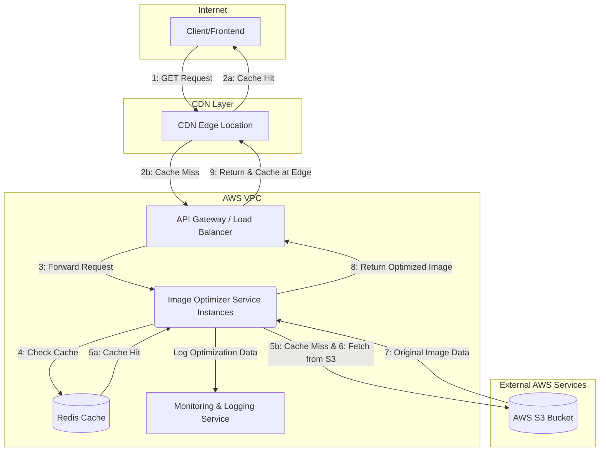

## **High-Level Design**

The high-level architecture focuses on creating a stateless, scalable, and resilient microservice that fits within a larger CDN pipeline. The system is composed of several key components working in concert to deliver optimized images efficiently.

### **System Architecture Diagram**



### **Detailed Architectural Walkthrough & Considerations**

1.  **CDN Integration**: The initial request from a client hits a Content Delivery Network (CDN) like AWS CloudFront.
    - **Thought**: This is the primary caching layer. If an identical request (same path and query parameters) has been made before, the CDN serves the optimized image directly from an edge location close to the user, providing the fastest possible response. This handles the vast majority of traffic for popular images.

2.  **API Gateway & Load Balancer**: On a CDN cache miss, the request is forwarded to an API Gateway or Application Load Balancer (ALB).
    - **Thought**: The ALB is the entry point into the VPC. Its main roles are to terminate TLS (HTTPS), provide a stable endpoint, and distribute incoming requests across multiple instances of the Image Optimizer Service. This is fundamental to achieving scalability and handling concurrent requests efficiently.

3.  **VPC and Private Networking**: All core components (the service instances, cache, and S3 bucket access) reside within a secure AWS Virtual Private Cloud.
    - **Thought**: This isolates the service from the public internet, enhancing security. Communication between the service and S3 should happen over a **VPC Gateway Endpoint**. This ensures traffic does not leave the AWS network, which is more secure and can reduce data transfer costs.

4.  **Application-Level Caching (Redis)**: When a request reaches a service instance, the first thing it does is check a secondary, application-level cache like Redis.
    - **Thought**: This cache prevents redundant processing. If one CDN location misses, but another has already triggered the image's creation, this cache stops the service from wastefully fetching the same file from S3 and processing it again. The cache key must be a unique signature of the request, for instance, a hash of the full path and sorted query parameters.

5.  **The Processing Core**: If both caches miss, the service proceeds.
    - **Fetch**: It retrieves the source image from the S3 bucket.
    - **Process**: It uses a library like Pillow to resize, reformat, and adjust the quality of the image based on the request parameters.
    - **Store**: The newly optimized image is saved to the Redis cache before being returned.
    - **Return**: The optimized image is sent back as the HTTP response.

6.  **Logging and Monitoring (Bonus)**: The service should log important statistics for each processing request.
    - **Thought**: For every original image processed, the service should log the processing time, original file size, and optimized file size. These structured logs (e.g., in JSON format) can be sent to a service like Amazon CloudWatch. This data is invaluable for monitoring performance, identifying bottlenecks, and understanding optimization effectiveness.

7.  **Edge Case Handling**:
    - **Image Not Found**: If the requested `image_path` does not exist in the S3 bucket, the service must gracefully handle the error and return an HTTP `404 Not Found` status.
    - **Invalid Parameters**: If the request contains invalid parameters (e.g., `w=abc` or `q=200`), the service should return an HTTP `400 Bad Request` status with a descriptive error message.
    - **Aspect Ratio**: When only one dimension (height or width) is provided, the service must maintain the original image's aspect ratio to avoid distortion.

### **Request Flow**

1. A consumer requests an image with specific optimization parameters, for example: `GET /images/landscapes/main.jpg?w=400&format=webp`.
2. The API Gateway routes the request to an available instance of the Image Optimizer service.
3. The service generates a unique **cache key** based on the request path and query parameters (e.g., `hash('images/landscapes/main.jpg?w=400&format=webp')`).
4. The service queries the **Cache (Redis)** with this key.
   - **On Cache Hit**: The cached, optimized image is retrieved and returned directly in the HTTP response. The request is complete.
   - **On Cache Miss**: The flow continues.
5. The service fetches the original image (`landscapes/main.jpg`) from the **AWS S3 bucket**.
6. The fetched image data is passed to the **Image Processor**.
7. The processor resizes, reformats, and adjusts the quality of the image according to the query parameters.
8. The newly optimized image is stored in the **Cache (Redis)** using the cache key from step 3.
9. The final image is returned to the client as the HTTP response with the appropriate `Content-Type` header (e.g., `image/webp`).

---

## **Low-Level Design**

The low-level design details the implementation specifics within the Django project, including project structure, key code components, and deployment configuration.

### **Project Structure**

```
/image-optimizer/
├── .env.example                # Environment variable template
├── Dockerfile                  # Instructions to build the service container
├── docker-compose.yml          # Local development setup
├── README.md                   # Setup and usage instructions
├── requirements.txt            # Python dependencies (django, gunicorn, pillow, boto3, python-dotenv, redis)
└── src/
    ├── optimizer/              # The core Django app
    │   ├── __init__.py
    │   ├── apps.py
    │   ├── exceptions.py       # Custom exceptions (e.g., ImageNotFound)
    │   ├── services.py         # Business logic (S3, Caching, Image Processing)
    │   ├── urls.py             # App-specific URL routing
    │   ├── views.py            # API view logic
    │   └── tests.py
    └── project/                # Django project configuration
        ├── __init__.py
        ├── asgi.py
        ├── settings.py         # Project settings
        ├── urls.py             # Project-level URL routing
        └── wsgi.py
```

## Future Considerations

### **High-Level Design Changes**

1.  **CDN Caching Strategy**:
    - The CDN (e.g., AWS CloudFront) must be configured to **cache based on specific query parameters** such as `h`, `w`, `format`, and `q`. This is critical for maximizing CDN offload and minimizing origin processing for different image variations.

### **Low-Level Design Changes**

1.  **Robust Parameter Validation (`optimizer/views.py`)**:
    - Implement explicit and comprehensive validation for all incoming query parameters (`h`, `w`, `format`, `q`).
        - **Numeric Parameters**: `width`, `height` must be positive integers, and `quality` must be an integer between 0 and 100. Invalid numeric inputs should return a `HTTP 400 Bad Request` with a descriptive error.
        - **Format Parameter**: Validate that the requested `format` is supported by the image processing library (e.g., `jpg`, `png`, `webp`). Unsupported formats should result in a `HTTP 400 Bad Request`.
        - **Aspect Ratio Handling**: When only one dimension (`height` or `width`) is provided, explicitly ensure the original image's aspect ratio is maintained to avoid distortion.

2.  **Asynchronous Logging**:
    - For high-traffic scenarios, move logging operations (e.g., processing time, size changes) out of the critical request path to an asynchronous process. This can be achieved using a dedicated logging library with asynchronous handlers or by pushing log data to a message queue (e.g., AWS SQS or Kinesis) for eventual ingestion into a monitoring service like Amazon CloudWatch. This minimizes latency and improves scalability.

3.  **Image Processing Error Handling (`optimizer/services.py`)**:
    - Enhance error handling within the `_process_image` method to specifically catch `PIL.UnidentifiedImageError` or similar exceptions if the image data is corrupted or an unsupported format is encountered during `Image.open()`. This provides more granular error responses than a generic `Exception`.

4.  **Graceful Shutdown in Dockerfile**:
    - Add a `--timeout` parameter to the `gunicorn` command in the `Dockerfile` (e.g., `CMD ["gunicorn", "--workers", "4", "--timeout", "30", "project.wsgi:application", "--bind", "0.0.0.0:8000"]`). This ensures that the application has sufficient time to complete ongoing requests before a container is terminated during deployments or scaling events, preventing dropped connections and incomplete responses.

5.  **Environment Variable for Cache Expiration**:
    - Externalize the Redis cache expiration time (default `ex=3600`) into an environment variable (e.g., `REDIS_CACHE_EXPIRATION_SECONDS`). This allows dynamic adjustment of caching policy without requiring code changes and re-deployments.


## Appendix
- [Bootstreap](https://github.com/BlackDChase/django-app)
